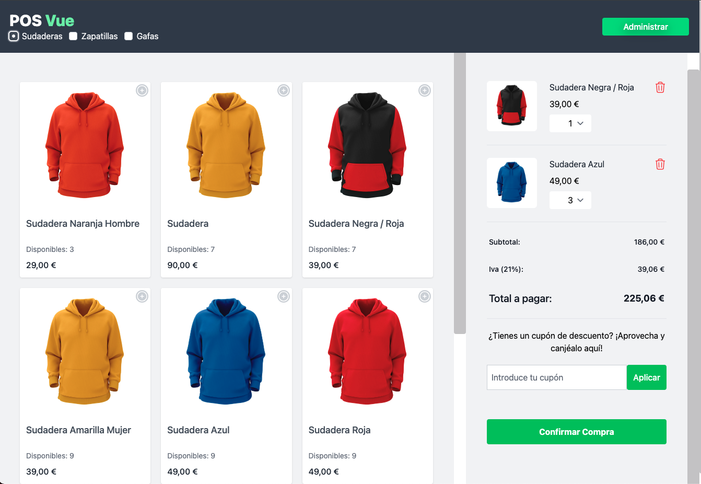
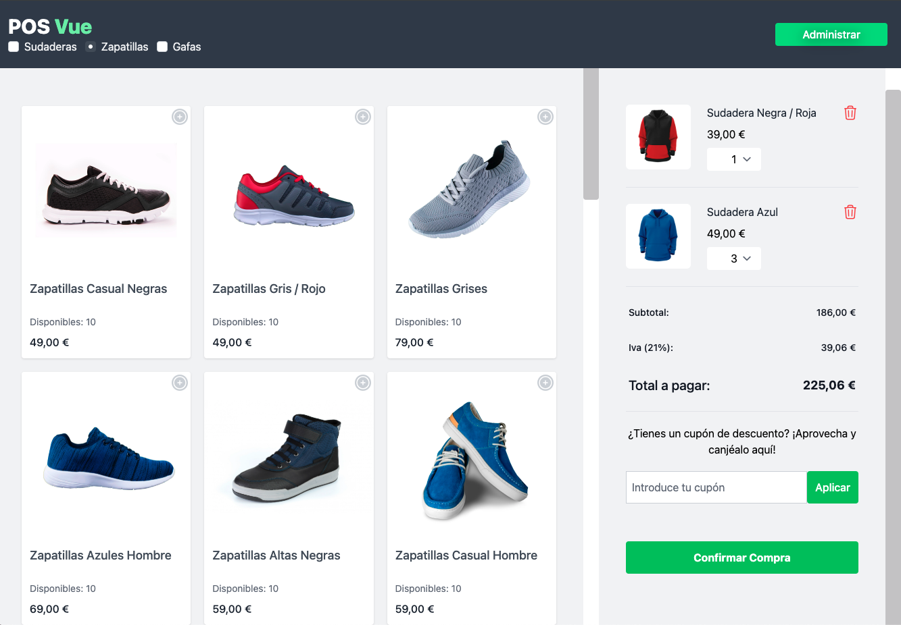

# POS Vue — Sistema de Punto de Venta con Vue 3 + Firebase


---

## 📄 Descripción

**POS Vue** es una aplicación de punto de venta (POS) desarrollada con **Vue 3**, **Pinia** y **Firebase**, orientada a comercios físicos o en línea. Permite gestionar productos, ventas, cupones y carrito de compras desde una interfaz moderna, modular y responsive. Está optimizada para escalar y adaptarse a nuevas funcionalidades de forma sencilla.

---


## 🌐 Demo

🔗 [pos-vue-js.vercel.app](https://eze-ms-pos-vue-js.vercel.app/)

---

## 🖼️ Capturas

#### Vista e-comerce 1


#### Vista e-comerce 2



---

## ✨ Funcionalidades

- Autenticación de usuarios mediante **Firebase Auth**
- Visualización y compra de productos
- Gestión de carrito de compras con cantidades dinámicas
- Aplicación de cupones de descuento
- Interfaz de administración para productos y ventas
- Detalle de ventas con información individual
- Diseño responsive con **Tailwind CSS**
- Sincronización en tiempo real usando **Firestore**

---

## 💻 Tecnologías Utilizadas

### Frontend

- **Vue.js 3** (Composition API)
- **Pinia** (gestión global del estado)
- **Vue Router**
- **Tailwind CSS**
- **Vite**

### Backend / Servicios

- **Firebase Authentication**
- **Firebase Firestore (DB en tiempo real)**

---

## 📋 Requisitos

- Node.js v18 o superior
- Cuenta de Firebase con Firestore habilitado
- Git

---

## 🧱 Estructura del Proyecto

```bash
POS-Vue/
├── src/
│   ├── assets/                # Estilos principales
│   ├── components/            # Componentes de UI (carrito, productos, navegación, etc.)
│   ├── composables/           # Hooks personalizados (ej: gestión de imágenes)
│   ├── config/                # Configuración de Firebase
│   ├── data/                  # Datos estáticos (productos)
│   ├── helpers/               # Utilidades generales
│   ├── router/                # Enrutamiento de vistas
│   ├── stores/                # Estado global (Pinia: productos, carrito, ventas, cupones)
│   └── views/                 # Vistas principales y de administración
├── tailwind.config.js         # Configuración Tailwind
├── vite.config.js             # Configuración Vite
├── vercel.json                # Configuración de despliegue

```

## 🛠️ Instalación

```bash
git clone https://github.com/eze-ms/Gestor-Ventas-POS

```

### Instalar dependencias del backend
```bash
npm install
```

### Iniciar servidor
```bash
npm run dev
```
---

© 2024. Proyecto desarrollado por Ezequiel Macchi Seoane